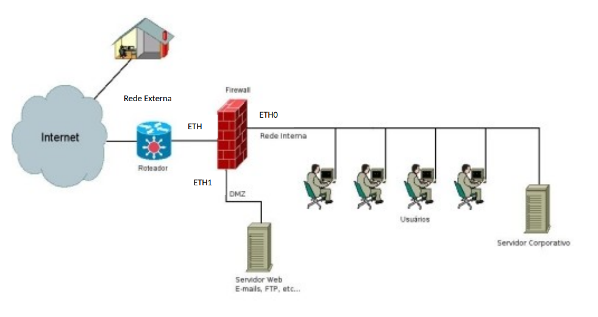

## IPTABLES Firewall - Exercício Prático / 1º de Abril de 2024

Desenvolva as regras apropriadas para estabelecer os controles a seguir, utilizando as diretivas do firewall Linux (netfilter/iptables):

1. Autorize todo o tráfego destinado à interface de loopback do firewall.
2. Aplique a política DROP (restritiva) para as cadeias INPUT e FORWARD na tabela filter.
3. Garanta que os usuários da rede interna tenham acesso ao serviço WWW nas portas (TCP) 80 e 443. Lembre-se de configurar NAT, pois os endereços IP internos não são válidos externamente.
4. Registre e proíba o acesso a sites que incluam a palavra "games" em seu conteúdo.
5. Impede o acesso de qualquer usuário ao site www.clickjogos.com.br, com exceção do gerente, que utiliza o endereço IP 10.1.1.100.
6. Permita que o firewall aceite pacotes ICMP echo-request (ping), limitando a taxa a 5 pacotes por segundo.
7. Assegure que tanto a rede interna quanto a DMZ possam efetuar consultas a servidores DNS externos e receber as respostas correspondentes.
8. Permita o tráfego TCP para o dispositivo 192.168.1.100 (DMZ) na porta 80, oriundo de qualquer rede (Interna ou Externa).
9. Redirecione pacotes TCP destinados ao IP 200.20.5.1 na porta 80 para o dispositivo 192.168.1.100 localizado na DMZ.
10. Configure o dispositivo 192.168.1.100 para responder corretamente aos pacotes TCP recebidos na porta 80.

Note que para serviços do tipo cliente-servidor, é essencial permitir pacotes de resposta. Portanto, crie regras que aceitem esses pacotes. O módulo state pode ser utilizado para facilitar essa configuração.

## Estrutura do Projeto

- firewall.dockerfile (arquivo de configuração para a criação do FIREWALL)
- firewall_rules.sh (script para configuração do FIREWALL)
- README.md (documento com instruções de uso)

## Pré-requisitos

- Sistema operacional Linux Mint 21.3 como HOST
- Docker versão 24.0.5

## Topologia da Rede

- Estrutura de rede com conexão à internet via roteador, passando por um firewall. No firewall, a entrada é pela ETH, dividindo-se em duas saídas, ETH0 e ETH1. A ETH0 direciona para uma rede interna com usuários e um servidor corporativo, enquanto a ETH1 conecta a uma DMZ, alcançando servidores Web, FTP e de e-mails.

    

  - Representação da topologia descrita.

- Configurações de rede:
  - Rede Interna: 10.1.1.0/24, ETH0: 10.1.1.1/24
  - DMZ: 192.168.1.0/24, ETH1: 192.168.1.1/24
  - Rede Externa: 200.20.5.0/30, ETH2: 200.20.5.1/30

## Configuração da Rede do Container

- A rede "rede" foi estabelecida com o endereço "192.168.1.0/24" através do comando "sudo docker network create --subnet=192.168.1.0/24 rede".
- Para incluir um container na rede "rede", utilize a flag "--net rede" no comando de execução, permitindo a comunicação entre containers na mesma rede.
- Para confirmar a criação da rede, execute "sudo docker network ls".

## Instruções de Uso

1. Faça o clone do repositório do Github.
2. Navegue até a pasta do projeto clonado através do terminal.
3. Inicie a construção do container FIREWALL com "sudo docker build -t nikolasdehor/firewall:latest -f firewall.dockerfile .".
4. Com o container FIREWALL criado, execute "sudo docker run -d --name firewall --restart always --net rede --privileged nikolasdehor/firewall" para iniciar o serviço.
5. Para acessar o container em funcionamento, use "sudo docker exec -it firewall /bin/bash".
6. Para interromper o container, digite "sudo docker stop firewall".

## Funcionamento

- FIREWALL:
  - O container é configurado com um script chamado "firewall_rules.sh", que contém as definições necessárias para o serviço FIREWALL. Ele implementa os controles de acesso à rede conforme as regras especificadas no exercício.

## Testes

- FIREWALL:
  - Para garantir a correta configuração do FIREWALL, siga os passos abaixo:
    1. Acesse o ambiente do container FIREWALL.
    2. Verifique as regras atuais do firewall com "iptables -L".
    3. Confira as regras de NAT com "iptables -t nat -L".
    4. Inspecione as regras de MANGLE com "iptables -t mangle -L".
    5. Examine as regras de RAW com "iptables -t raw -L".
    6. Avalie as regras de SECURITY com "iptables -t security -L".
    7. Revise as regras de FILTER com "iptables -t filter -L".